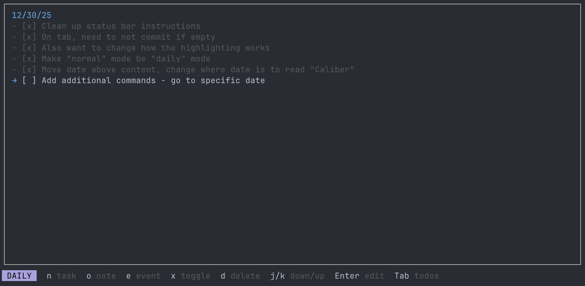

# Caliber

A simple, bullet journal-inspired way to capture tasks and notes while you work in the terminal.



## Installation

```bash
cargo install caliber
```

Requires Rust 1.85+ (edition 2024).

## Usage

```bash
caliber              # Open journal
caliber /path/to.md  # Use specific journal file
caliber init         # Create config file
```

### Daily View

| Key | Action |
|-----|--------|
| `n` | New task |
| `o` | New note |
| `e` | New event |
| `j/k` | Navigate down/up |
| `Enter` | Edit entry |
| `x` | Toggle task complete |
| `d` | Delete entry |
| `h/l` or `[/]` | Previous/next day |
| `t` | Go to today |
| `Tab` | Switch to Todos view |
| `:q` | Quit |

### Editing

| Key | Action |
|-----|--------|
| `Enter` | Save |
| `Tab` | Save and create another |
| `Esc` | Cancel |

### Todos View

Shows incomplete tasks across all days.

| Key | Action |
|-----|--------|
| `j/k` | Navigate down/up |
| `x` | Toggle complete |
| `Enter` | Jump to day |
| `Tab/Esc` | Back to Daily view |

## Journal Format

Caliber uses a markdown-compatible format:

```markdown
# 2025/01/15
- [ ] Incomplete task
- [x] Completed task
- A note
* An event
```

## Configuration

Config file: `~/.config/caliber/config.toml`

```toml
# Custom default journal path
default_file = "/path/to/journal.md"
```

Default journal location: `~/.config/caliber/journals/journal.md`

## License

MIT
